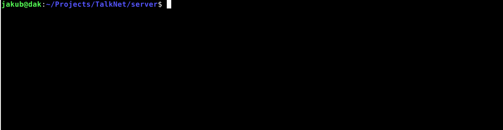
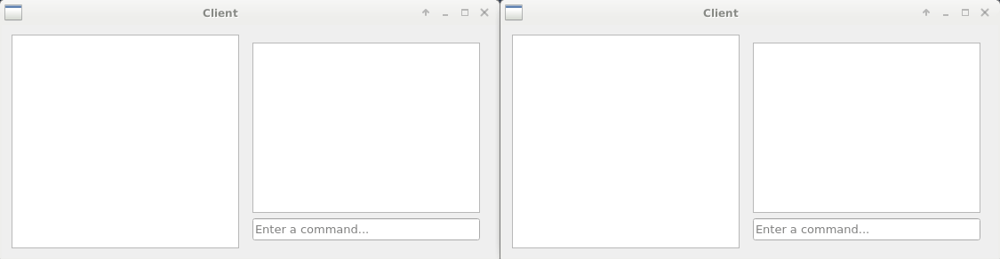

# TalkNet
TalkNet is an online IPv4 communicator written with Qt. It provides both the
server and the client programs which can be installed separately.

## Dependencies
* [SocketIO](https://github.com/dak98/SocketIO)
* [Qt 5.11.3](https://www.qt.io/)
* A compiler supporting C++11

## Obtain
```
git clone https://github.com/dak98/TalkNet.git
```

## Install the server [client]
```
cd server [client]
mkdir build
cd build
qmake ../server.pro [../client.pro]
make
```

## Usage
Both the server and the client have two windows:
* a display window showing the overall trafic (server) or incoming messages
  (client) on the left,
* a console to issue commands on the right.
### Server
The server can list all the connected clients and send messages to them. You
also see the trafic between clients.


### Client
The clients are able to communicate between each other via the `SENDTO`
command. To message yourself, use the `ECHO` command. Type `INFO` to display
your ID.


If wrong syntax is used (e.g. wrong number of parameters), an appropriate error
message is shown.